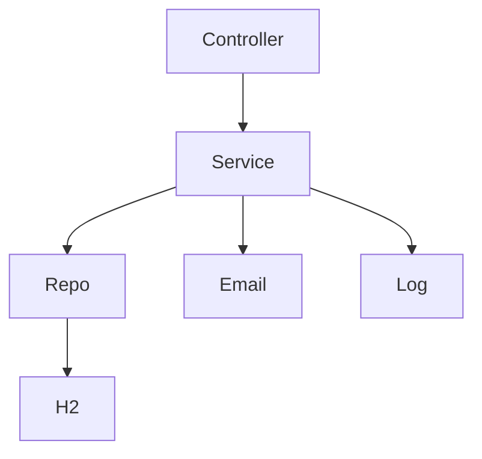

# 🏦 BankApp - Advanced Banking System  [](https://maven.apache.org/) 

[](https://github.com/yourusername/bankapp)

**Secure, production-ready Spring Boot banking app** with REST APIs, Thymeleaf UI, email notifications (env vars), balance alerts, transaction logging.

## 📋 Table of Contents
- [Features](#features)
- [Screenshots](#screenshots)
- [Quick Start](#quick-start)
- [Environment Variables](#environment-variables)
- [Run in IntelliJ](#run-in-intellij)
- [Architecture](#architecture)
- [API Endpoints](#api-endpoints)
- [Troubleshooting](#troubleshooting)
- [Deployment](#deployment)

## 🚀 Features
- Account mgmt (Savings/Checking, $100 min)
- Transactions (deposit/withdraw/transfer)
- History with balance snapshots
- Email welcome/low-balance alerts
- Web UI (login/signup/dashboard/history)
- H2 DB, logging

## 📸 Screenshots


## ⚡ Quick Start (Terminal)
```bash
cp .env.example .env  # Edit with Gmail app pass
mvn clean install
mvn spring-boot:run
```

## 🌍 Environment Variables
`.env.example` template (copy to `.env`):
```
MAIL_USERNAME=prodbot8@gmail.com
MAIL_PASSWORD=yjymwbjzfaszdmzj  # Your app pass
```

**Windows Terminal:**
```
set MAIL_USERNAME=prodbot8@gmail.com
set MAIL_PASSWORD=yjymwbjzfaszdmzj
mvn spring-boot:run
```

**Linux/Mac:**
```
export MAIL_USERNAME=prodbot8@gmail.com
export MAIL_PASSWORD=yjymwbjzfaszdmzj
mvn spring-boot:run
```

## 💻 Run in IntelliJ
1. Open project in IntelliJ.
2. Edit **Run Configuration** (Run > Edit Configurations):
   - Main class: `com.example.bankapp.BankAppApplication`
   - **Environment variables**: `MAIL_USERNAME=prodbot8@gmail.com;MAIL_PASSWORD=yjymwbjzfaszdmzj`
3. Run/Debug (Shift+F10).

**VM options** (if needed): `-Dspring.profiles.active=dev`

App starts at http://localhost:8080

## 🏗️ Architecture


## 📊 API Endpoints
| Method | Endpoint | Description |
|--------|----------|-------------|
| POST | /api/accounts | Create account |
| POST | /api/accounts/{id}/deposit | Deposit |
| POST | /api/accounts/{id}/withdraw | Withdraw |
| POST | /api/accounts/transfer | Transfer |
| GET | /api/accounts/{id}/history | History |

## ❓ Troubleshooting
- **Email auth failed**: Set MAIL_* env vars in IntelliJ Run Config.
- **H2**: /h2-console (jdbc:h2:mem:bankdb)
- Logs: `transactions.log`

## 🚀 Deployment
Docker/Heroku with env vars.

## 📄 License
MIT

