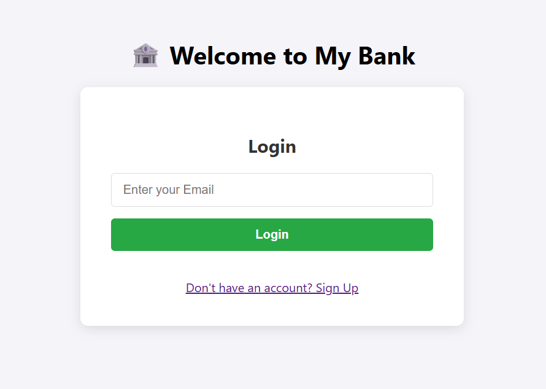
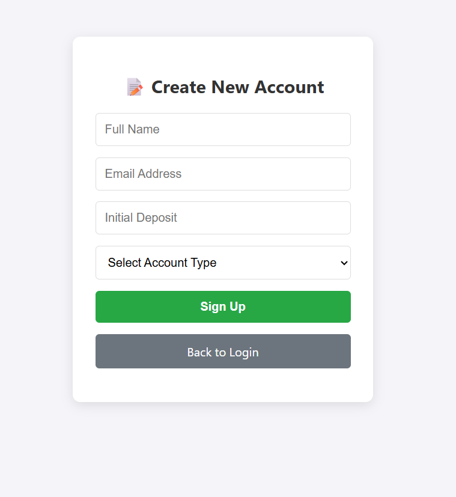
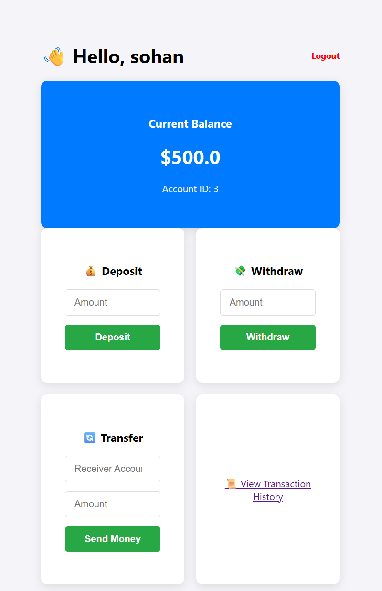
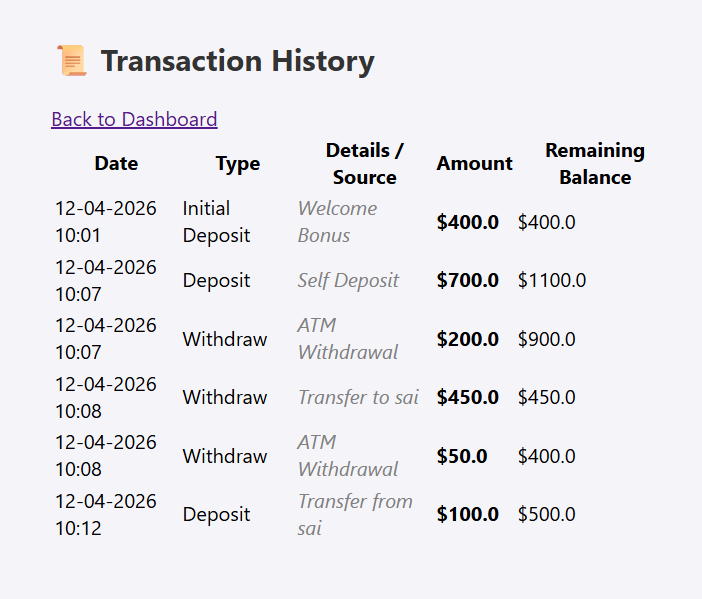
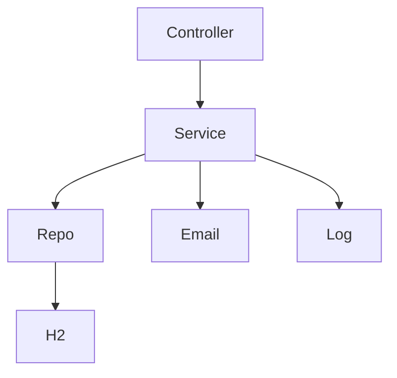
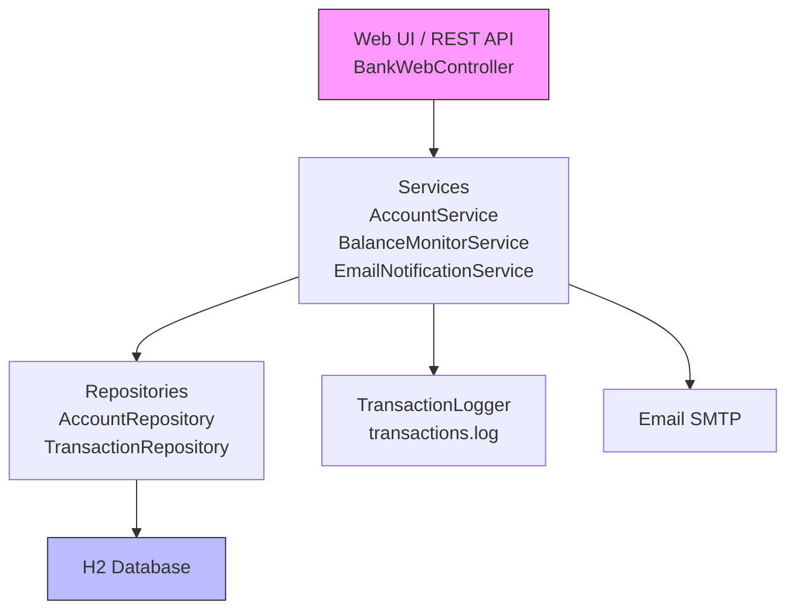

# 🏦 BankApp - Advanced Banking System
 [](https://maven.apache.org/) 

[](https://github.com/yourusername/bankapp)

**Secure, production-ready Spring Boot banking app** with REST APIs, Thymeleaf UI, email notifications (env vars), balance alerts, transaction logging.

## 📋 Table of Contents
- [Features](#features)
- [Screenshots](#screenshots)
- [Quick Start](#quick-start)
- [Environment Variables](#environment-variables)
- [Run in IntelliJ](#run-in-intellij)
- [Architecture](#architecture)
- [API Endpoints](#api-endpoints)
- [Troubleshooting](#troubleshooting)

## 🚀 Features
- Account mgmt (Savings/Checking, $100 min)
- Transactions (deposit/withdraw/transfer)
- History with balance snapshots
- Email welcome/low-balance alerts
- Web UI (login/signup/dashboard/history)
- H2 DB, logging

## 📸 Screenshots





## ⚡ Quick Start (Terminal)
```bash
cp .env.example .env  # Edit with Gmail app pass
mvn clean install
mvn spring-boot:run
```

## 🌍 Environment Variables
`.env template (copy to `.env`):
```
MAIL_USERNAME=xyz@gmail.com  #your email id
MAIL_PASSWORD=****************  # Your app pass
```

**Windows Terminal:**
```
set MAIL_USERNAME=xyz@gmail.com
set MAIL_PASSWORD=****************
mvn spring-boot:run
```

**Linux/Mac:**
```
export MAIL_USERNAME=xyz@gmail.com
export MAIL_PASSWORD=****************
mvn spring-boot:run
```


App starts at http://localhost:8080

## 🏗️ Architecture


## 📊 API Endpoints
| Method | Endpoint | Description |
|--------|----------|-------------|
| POST | /api/accounts | Create account |
| POST | /api/accounts/{id}/deposit | Deposit |
| POST | /api/accounts/{id}/withdraw | Withdraw |
| POST | /api/accounts/transfer | Transfer |
| GET | /api/accounts/{id}/history | History |

## ❓ Troubleshooting
- **Email auth failed**: Set MAIL_* env vars in IntelliJ Run Config.
- **H2**: /h2-console (jdbc:h2:mem:bankdb)
- Logs: `transactions.log`

**Layers**: MVC pattern with service layer for business logic, JPA repos for persistence.

## 📊 API Endpoints

| Method | Endpoint | Description | Parameters | Response | Status |
|--------|----------|-------------|------------|----------|--------|
| GET | `/api/accounts` | List all accounts | - | JSON Account[] | 200 |
| POST | `/api/accounts` | Create account | `{name, email, balance(≥100), type}` | JSON Account | 201 |
| POST | `/api/accounts/{id}/deposit` | Deposit | `amount, source(opt)` | JSON Account | 200 |
| POST | `/api/accounts/{id}/withdraw` | Withdraw | `amount, source(opt)` | JSON Account or 400 (InsufficientFunds) | 200/400 |
| POST | `/api/accounts/transfer` | Transfer | `fromId, toId, amount` | JSON success msg | 200 |
| GET | `/api/accounts/{id}/history` | History | - | JSON Transaction[] | 200 |


## ⚙️ Advanced Features
<details>
<summary>Click to expand</summary>

### Email Notifications
- Uses `spring-boot-starter-mail` with Gmail SMTP (env vars).
- Welcome email on signup.
- Low-balance alert (<$100) via `BalanceMonitorService` – flags `lowBalanceAlertSent` to prevent spam.

### Transaction Logging
- `TransactionLogger` appends to `transactions.log`: format `[TIMESTAMP] [TYPE] [AMOUNT] [BALANCE] [SOURCE]`.
- Example: `2024-01-01 12:00 Deposit 500.0 1500.0 Self Deposit`.

### Error Handling
- `InsufficientFundsException`: Custom exception → 400 Bad Request JSON.

### Balance Monitor
- Post-transaction check; email if below threshold.

</details>


## 🛣️ Roadmap
- JWT auth
- Prod DB (PostgreSQL)
- Tests

## 🤝 Contributing
Fork > Branch > PR

## 📄 License
MIT

